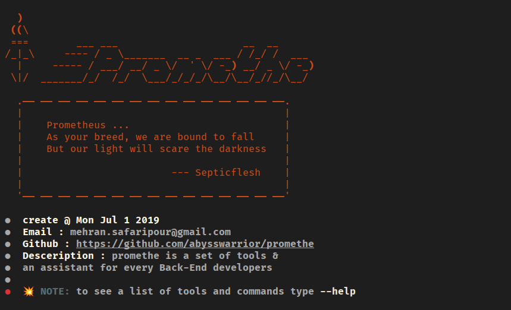

<p align="center">
  <br/>

  
  
</p>

# Promethe: Illuminating Backend Brilliance

Promethe is a command-line tool created with Python and the Typer library,designed to empower backend developers with a
collection of essential utilities. From network diagnostics to DevOps automation, Promethe serves as your trusted
assistant, simplifying tasks and illuminating the path to efficient development

# Who is Promethe ?

The name "Promethe" draws inspiration from the ancient Greek myth of Prometheus, who stole the fire of knowledge from
the gods and bestowed it upon humanity. In a similar spirit, Promethe is crafted to provide backend developers with
insights and capabilities that shed light on their challenges.

# Features

- [x] dns lookup
- [x] show your public ip
- [x] show your location based on public ip
- [ ] server port scaner
- [ ] create ssh tunnels
- [ ] services health checker
- [ ] website vulnerability checker
- [ ] dockerized project automatically
- [ ] generate docker-compose.yml for common stacks (like postgres and pgAdmin, ...)
- [ ] initiate base django project based on best practices (with cookiecutter)
- [ ] turn into a `pip` package
- [ ] turn into a `apt` package


# Requirements

```markdown
- python version >= 3.8
```

# Run Locally

**Step 1 :** create a new virtualenv and install requirements.

```shell
$ pip install -r requirements.txt
```

**Step 2 :** run `promethe.py` and use `--help` to see the list of tools.

```shell
$ python promethe.py --help
```

# Screenshots



# Contribution

Give a ⭐️ if you find this project intriguing, share your insights, and let's keep the conversation alive. Contributions are
very welcome.

## You can help this project by Donating

[](https://buymeacoffee.com/promethe)

# License

Made by ❤️ under [MIT](https://choosealicense.com/licenses/mit/) license.

